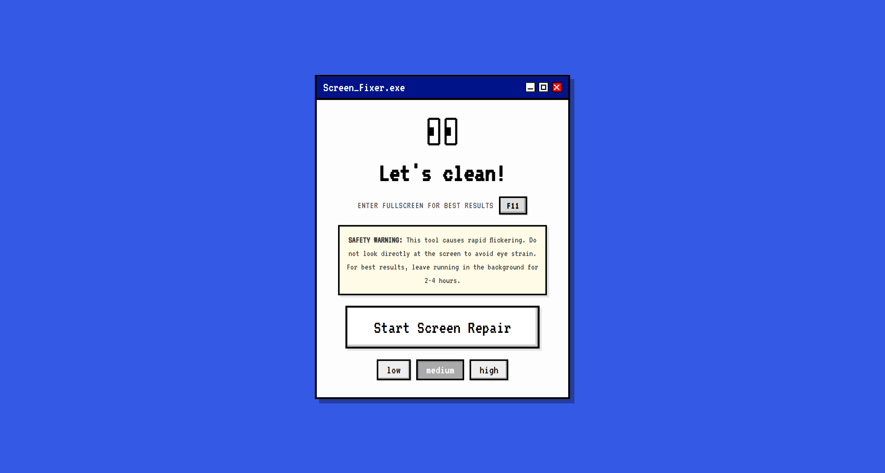

# ScreenFixer 📺✨

[](LICENSE)

A professional-grade, retro-styled screen restoration tool. ScreenFixer helps alleviate image retention and "stuck pixels" by cycling high-intensity colors while providing a nostalgic 90s-era operating system experience.



## 🚀 Features

- **Pixel Restoration**: High-speed color cycling to stimulate stagnant pixels.
- **Adjustable Intensity**: Choose between Low, Medium, and High refresh rates.
- **Retro OS Interface**: A fully interactive window management system with a "crumble-and-restore" animation logic.
- **Fullscreen Mode**: Dedicated immersion mode for maximum efficiency.
- **Safety First**: Integrated safety disclaimers and eye-strain warnings.

## 🛠️ Tech Stack

- **Framework**: [Next.js 15](https://nextjs.org/) (App Router)
- **Styling**: [Styled Components](https://styled-components.com/)
- **Animation**: CSS Keyframes & Framer-like custom transitions
- **Testing**: [Jest](https://jestjs.io/) & [React Testing Library](https://testing-library.com/docs/react-testing-library/intro/)
- **Quality**: [Knip](https://knip.dev/) & [ESLint](https://eslint.org/)

## 📦 Getting Started

### Prerequisites

- Node.js 24+
- npm or yarn

### Installation

1. Clone the repository:

   ```bash
   git clone https://github.com/struggyyy/ScreenFixer.git
   cd ScreenFixer
   ```

2. Install dependencies:

   ```bash
   npm install
   ```

3. Run the development server:
   ```bash
   npm run dev
   ```

Open [http://localhost:3000](http://localhost:3000) with your browser to see the result.

## 🧪 Testing & Quality

We maintain a high standard of code quality with >95% test coverage.

- **Run Tests**: `npm test`
- **Coverage Report**: `npm run test:coverage`
- **Health Check**: `npm run check` (Lints, Formats, Tests, and Dead-code analysis)

## 📄 License

This project is proprietary and confidential. All rights reserved. See the [LICENSE](LICENSE) file for details.

## ⚠️ Disclaimer

**WARNING: FLICKERING IMAGES.** This application produces rapid color changes. Do not use this tool if you have a history of photosensitive epilepsy or are sensitive to flashing lights.
